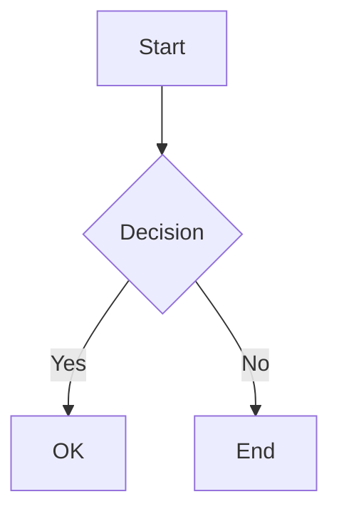
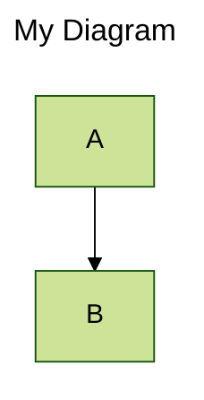

# Mermaid Editor

A modern, web-based tool for creating beautiful diagrams using [Mermaid.js](https://mermaid.js.org/).

## ✨ Features

### Editor & Preview
- **Real-time Rendering**: Diagrams update automatically as you type
- **Enhanced Editor**: Code editor with line numbers for better readability
- **Split View**: Adjustable resizable panels between code and preview (layout saved automatically)
- **Zoom & Pan**: Navigate large diagrams with mouse controls or zoom buttons
- **Background Patterns**: Toggle between dot and grid patterns for better visualization

### Error Handling & Feedback
- **Detailed Error Messages**: Clear syntax error reporting in the preview area
- **Visual Feedback**: Toast notifications for all actions

### Save & Share
- **Auto-Save**: Automatic local storage backup (1-hour expiration)
- **Shareable URLs**: Generate encoded URLs to share diagrams
- **File Operations**: Save/load Mermaid code as `.txt` or `.mmd` files
- **Export Options**: Download as high-quality PNG or JPG images

### UI & Design
- **Modern Interface**: Clean, gradient-based design with animated header
- **Responsive Layout**: Works on desktop and mobile devices
- **Sample Library**: 23 built-in diagram examples (flowchart, sequence, gantt, etc.)
- **Customizable Gutter**: Stylish resizable split bar with hover effects

## 🚀 How to Use

1. Open `index.html` in your web browser (no build process required)
2. Enter Mermaid diagram syntax in the left editor pane
3. View the rendered diagram in real-time on the right
4. Use toolbar buttons to:
   - **Share**: Copy shareable URL to clipboard
   - **Save/Load**: Export or import diagram code
   - **Export**: Download as PNG or JPG image
   - **Background**: Toggle between dot/grid patterns

## 📚 Mermaid Syntax

### Basic Example


### With Frontmatter (Theme & Config)


**Available Themes**: `default`, `forest`, `dark`, `neutral`, `base`

For more syntax details, visit the [official Mermaid documentation](https://mermaid.js.org/syntax/flowchart.html).

## 🛠️ Technologies Used

- **Core**: HTML5, CSS3, Vanilla JavaScript
- **Libraries**:
  - [Mermaid.js](https://mermaid.js.org/) v11+ - Diagram rendering
  - [Split.js](https://split.js.org/) 1.6.5 - Resizable panels
  - [svg-pan-zoom](https://github.com/ariutta/svg-pan-zoom) 3.6.1 - SVG interaction

## 📂 Project Structure

```
mermaid-editor/
├── index.html          # Main HTML file
├── style.css           # Styling and layout
├── script.js           # Application logic
├── README.md           # Documentation
└── LICENSE             # MIT License
```

## 📋 Supported Diagram Types

- Flowchart
- Sequence Diagram
- Class Diagram
- State Diagram
- Entity Relationship
- User Journey
- Gantt Chart
- Pie Chart
- Quadrant Chart
- Requirement Diagram
- GitGraph
- C4 Diagram
- Mindmaps
- Timeline
- Sankey
- XY Chart
- Block Diagram
- Packet
- Kanban
- Architecture
- Radar Chart
- Treemap

## 📝 License

This project is licensed under the MIT License - see the [LICENSE](LICENSE) file for details.
